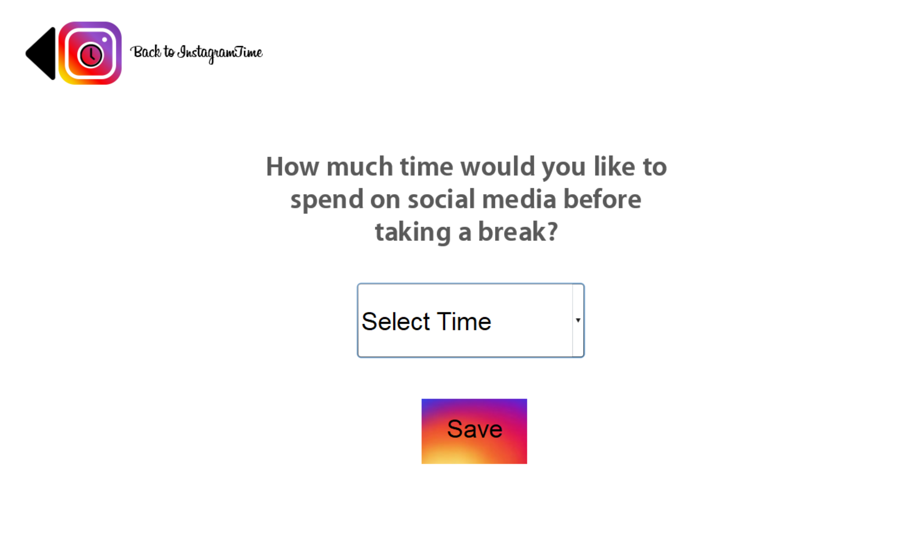

# InstagramTime

### A Concept Project, Created by Allaire Morgan

-------------------------------------------------------------------------------------------------------------------------------------------

**Too often, I find myself wasting away hours** on end scrolling through the bottomless feeds of social media. Not only did it occupy my time and productivity, social media began to deteriorate my self image, feed my insecurities, and introduce me into an endless cycle of comparing myself to peers. When talking with friends about my predicament, I found a majority of people my age feel the same way about social media. Noting this was a problem, I created a concept app which limits scrolling time and forces users to take a break.

## The App

InstagramTime begins by setting a time limit on scrolling on social media.

**The settings screen allows users to choose times ranging from 5 minutes to 1 hour.** In a further implementation, the time limit setting would be integrated with the settings screen on Instagram or a relevant social media profile.

After setting a time limit, the user is free to use the main app while the timer counts down.

**For demonstrative purposes,** the main screen is a brief infographic about InstagramTime. To further the project, the main screen would be the main interface for Instagram or a relevant social media account.

When the time limit has elapsed, the user is then directed to a waiting screen. The screen has no interactive features, forcing the user to wait 20 minutes until the app is re-enabled. The intent behind the waiting screen is to encourage the user to spend time away from their phone and get back to enjoying the day.

