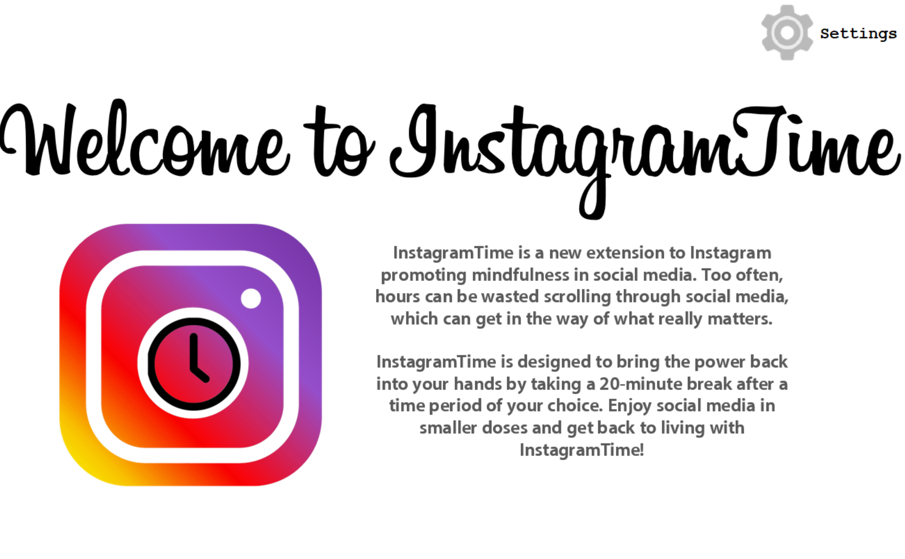
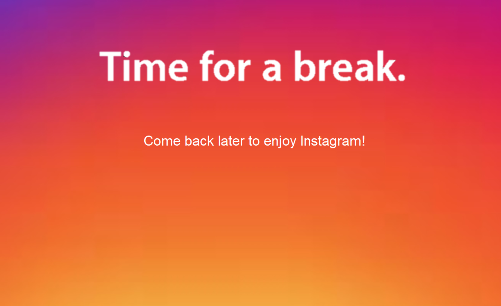

# InstagramTime

### A Concept Project, Created by Allaire Morgan

-------------------------------------------------------------------------------------------------------------------------------------------

**Too often, I find myself wasting away hours** on end scrolling through the bottomless feeds of social media. Not only did it occupy my time and productivity, social media began to deteriorate my self image, feed my insecurities, and introduce me into an endless cycle of comparing myself to peers. When talking with friends about my predicament, I found a majority of people my age feel the same way about social media. Noting this was a problem, I did a little more research into the effects of social media use and created a concept app which limits scrolling time and forces users to take a break.

## The Problem

**Small studies are showing big results** with the harmful effects of social media. A study by the University of Pittsburgh found subjects between the ages of 19 and 32 who use social media within 30 minutes of sleep are 1.62 times as likely to experience sleep disturbance. [Source](https://academic.oup.com/sleep/article/40/9/zsx113/3926043) Similarly, a study supported by the National Institute of Health finds subjects who use social media at an increased frequency are 2.18 times as likely to have eating concerns; the study further suggests a similar correlation between social media use and body image concerns. [Source](https://www.ncbi.nlm.nih.gov/pmc/articles/PMC5003636/) Multiple studies call for additional research on the correlation between social media use and mental health problems in order to gain a larger and more reliable dataset.

With social media comes a new ability to connect with others instantly. While increased connectivity makes socialization simple and instant, there are added consequences that come with it. The structure around likes is addictive, where the brain's reward system is activated when a post is liked by others. Likes lead to a downward spiral of comparison to a vast social network of peers, which can quickly deteriorate self-esteem. The effects of social media are imminent and potentially dangerous, and the most effective solution (other than deleting all social media accounts) is to simply put the phone down and take a break. InstagramTime hopes to build that break into the social media experience.

## The App

**InstagramTime features are designed to implement seamlessly into the functionality of Instagram so as to alter but not disrupt the user experience.** Below is a walkthrough of the app and a brief explanation of how it would integrate into existing social media sites.

InstagramTime begins by setting a time limit on scrolling on social media.

**The settings screen allows users to choose times ranging from 5 minutes to 1 hour.** In a further implementation, the time limit setting would be integrated with the settings screen on Instagram or a relevant social media profile.

After setting a time limit, the user is free to use the main app while the timer counts down.

**For demonstrative purposes,** the main screen is a brief infographic about InstagramTime. To further the project, the main screen would be the main interface for Instagram or a relevant social media account.

When the time limit has elapsed, the user is then directed to a waiting screen. The screen has no interactive features, forcing the user to wait 20 minutes until the app is re-enabled. The intent behind the waiting screen is to encourage the user to spend time away from their phone and get back to enjoying life.

